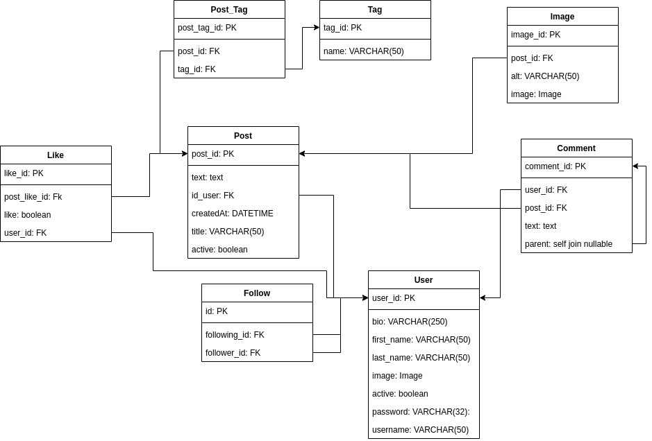

## twitter_social_network
> **This is the second project in Daneshkar Bootcamp, which aims to create a social network similar to Twitter**


## ERD of This project




## **Installation**


```
pip install -r requirements.txt
```


## **Usage in linux**
```
  1. python3 -m venv venv
```
```
  2. source venv/bin/activate
```
```
  3. install requirements.text
``` 
```
  4. python manage.py migration
``` 
```
  5. python manage.py runserver
```
 
 

**After completing the mentioned steps, a link will be displayed that by holding down the ctrl button and selecting this link, you will be redirected to the Twitter homepage in this project. On this page, you can search for accounts based on their username and posts based on their title.**

